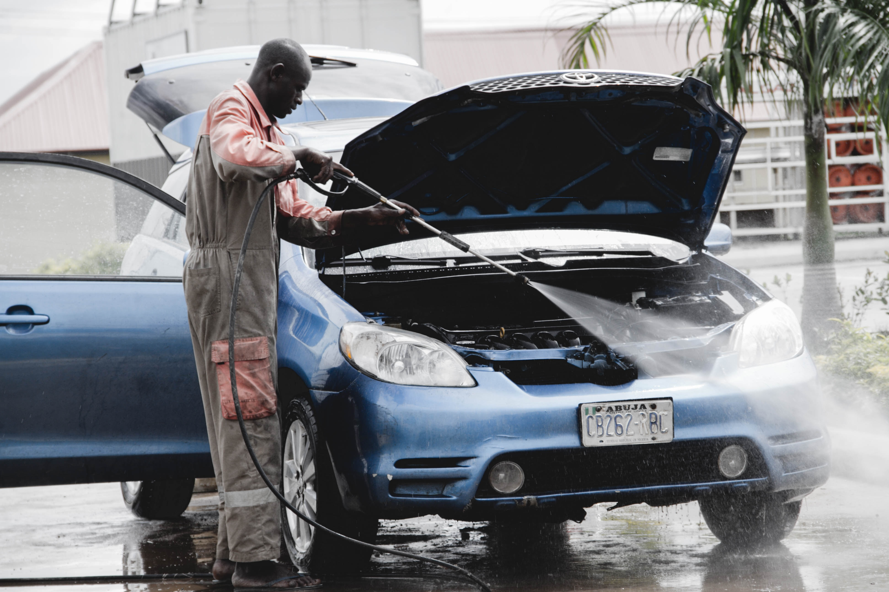

# Sparkle Auto Spa Car Wash



[](https://github.com/bollo-omar/sparkle-auto-spa-carwash/blob/main/LICENSE)
[](https://github.com/bollo-omar/sparkle-auto-spa-carwash/stargazers)

Sparkle Auto Spa is a carwash business portfolio website that showcases the services, facilities, and expertise of the Sparkle Auto Spa brand. It provides an attractive and informative platform for potential customers to explore the offerings of Sparkle Auto Spa.

## Introduction

Visit the [Sparkle Auto Spa Website](https://sparkle-auto-spa-carwash.vercel.app) to experience the services and expertise of Sparkle Auto Spa. You can also read the [Project Blog Article](https://medium.com/@bolloo18/my-alx-portfolio-project-30f7ed2c772) to learn more about the development process and insights gained from building this project.

This project is created and maintained by :
1. [Bollo Aggrey Omondi](https://www.linkedin.com/in/aggrey-bollo-51695780/).
2. Alex Gikonyo
3. Victor Amonde

## Technical Details
The Sparkle Auto Spa website is built using the following technologies and tools:

***Next.js***: *Chosen for its server-side rendering and efficient routing capabilities, enabling fast and optimized performance.
***SQLite***: *Utilized as the lightweight and flexible database solution to store and manage service information and customer inquiries.
***Vercel***: *Selected as the deployment platform for its seamless integration with Next.js and convenient deployment workflow.*
To enhance the user experience, I implemented a responsive design using CSS media queries, ensuring the website looks and functions well across different devices and screen sizes. The contact form functionality is powered by serverless functions, allowing users to submit inquiries easily and securely.

## Technical Challenges
Throughout the development process, we faced a few technical challenges. One of the main hurdles was integrating the SQLite database with Next.js. I had to carefully design the database schema, implement data retrieval and manipulation methods, and ensure efficient querying. Additionally, optimizing the website's performance and achieving a fast loading speed was a priority, requiring careful code organization and performance optimization techniques.

## Future Improvements
As with any project, there is always room for improvement. In future iterations of the Sparkle Auto Spa website, we plan to implement additional features such as an online booking system, user authentication, and interactive service descriptions. we also aim to enhance the website's SEO capabilities to improve its visibility in search engine results.

## Installation

1. Clone the repository: `git clone https://github.com/bollo-omar/sparkle-auto-spa-carwash.git`
2. Install the dependencies: `npm install`

## Usage

To run the project locally, use the following command:

```bash
npm run dev
```

Open your browser and visit: `http://localhost:3000` to see the Sparkle Auto Spa website.

## Contributing

Contributions are welcome! If you find any bugs or have suggestions for improvements, please submit an issue or a pull request.

## Related Projects

N/A

## License

This project is licensed under the [MIT License](https://github.com/yourusername/sparkle-auto-spa/blob/main/LICENSE).
